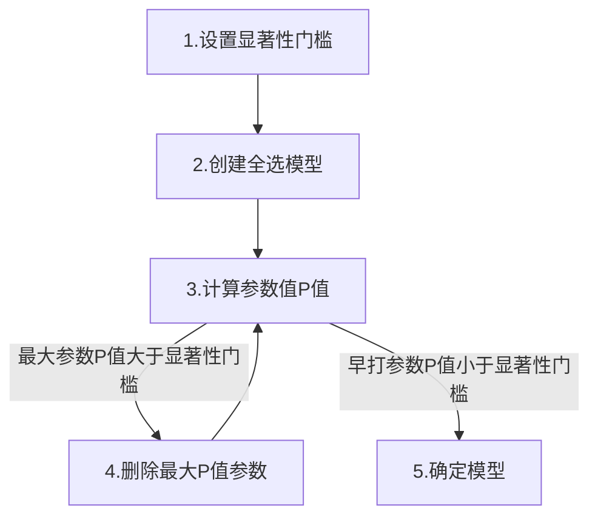
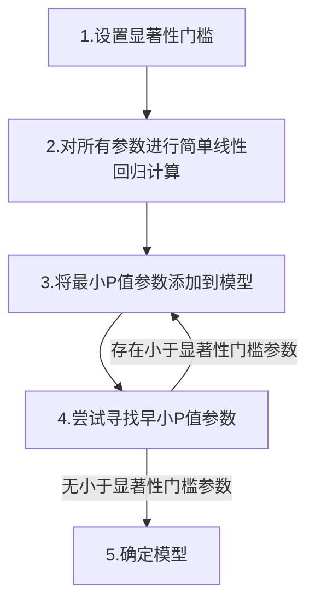
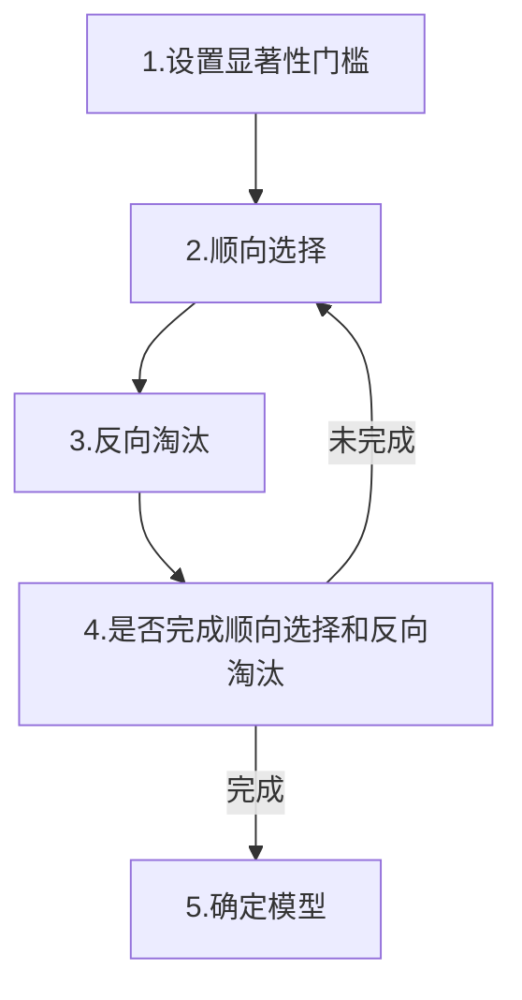

机器学习入门 05.多元线性回归
---

之前说了简单线性回归,简单线性回归就是只有一个子变量的回归函数,而还多时候我们的因变量受多个自变量的影响,那么这就是我们要说的多元线性回归.

多元线性回归中存在两个或两个以上的自变量,比如我们的工资不光受工作年限的影响,可能也受到工作行业,工作岗位的影响,工资值受这多个因数影响.

多元回归模型的一般形式是

$$ y=b_0+b_1*x_1+b_2*x_2+...+b_n*x_n $$

可以发现多元线性回归与简单线性回归很相似,区别就是自变量的个数不同.

多元线性回归存在一些限定条件

1. 线性 (Linearity)
2. 工方差性 (Homoscedasticity 
3. 多元正态分布 ()Multivariate normality
4. 误差独立 Independence of errors
5. 无多重共线性 Lack of multicollinearity

### 虚拟变量陷阱

之前说过对非数字类型字段,我们需要将其转换为虚拟变量,如国家.加入数据中存在国家字段

|price|location|
|:--:|:--:|
|1|A位置|
|2|B位置|
|3|B位置|
|4|A位置|

比如在`location`字段中存在`A位置`,`B位置`,`C位置`三种类型,我们没有办法需要将其转换为虚拟变量来进行计算.

|A位置|B位置|
|:--:|:--:
|1|0|
|0|1|
|0|1|
|1|0|

这样我们就通过虚拟变量来表示`location`列,这相当与在模型中添加了

$$ b_2 * x_2 + b3 * x_3 $$

但是其中存在了一些问题,`A位置`和`B位置`的值存在一些数据冗余,即多重共线性问题.

当`A位置 = 0`时,其实已经可以表示当前位置为`B位置`,而不需要添加`B位置 = 1`列来额外显示,`A位置`和`B位置`列关系可以表示为

$$ D_2 = 1 - D_1 $$

所以当原特征有M个类别时，如果将其转换成M个虚拟变量，就会导致变量间出现完全共线性的情况。所以我们其实并不需要将`B位置`列添加到模型中,可以总结来说当原特征有M个类别时，我们需要将其转换成M-1个虚拟变量.

### 模型建立

在问题中存在多种参数,但是我们应该只把对因变量有明显影响的参数加入到模型中来,但是我们如何来确定那些参数对因变量有显著性影响,来帮助我们确定模型参数.多元线性回归有五种常见的模型建立方式

1. 全部选择 All-in
2. 反向淘汰 Backward Elimination
3. 顺向选择 Forward Selection
4. 双向淘汰 Bidirectional Elimination 
5. 信息量比较 Score Comparision

`全部选择`和`信息量比较`是比较粗暴简单的方法,全部选择的方式就是将我们所有的参数,都添加到模型中参与计算.而信息量比较则是将所有组合进行尝试选出效果最好的组合.

一般使用的比较多的是`反向淘汰`,`顺向选择`,`双向淘汰`,他们又称为`逐步回归`

#### 反向淘汰

反向淘汰的思路是首先需要确定一个显著性门槛,然后首先进行全部选择创建模型,通过计算最大P值参数,将P值大于显著性门槛的参数删除,直到所有参数值小于显著性门槛,最终确定模型.




#### 顺向选择

反向淘汰是从全部中剔除影响小的参数,而顺向选择则是相反的思路是从所有参数中选择影响大的参数.首先还是需要先确定显著性门槛,下来我们需要对所有参数进行简单线性回归,选择小于显著性门槛的最小的P值.然后再剩下的参数中尝试添加不同参数哪个参数会带来早小的P值,直到无法选择出位置.



#### 双向淘汰

双向淘汰是反向淘汰和顺向选择的组合,首先需要设置两个显著性门槛,分别用于淘汰和选择.然后首先通过选择显著性门槛顺向选择来添加新的变量,之后通过淘汰显著性门槛反向淘汰来剔除旧的变量,直到无法选择到新的变量也无法剔除旧的变量时模型建立成功.




#### 反向淘汰实现 - python

多元线性回归依然使用`sklearn.linear_model.LinearRegression`线性回归模型来计算.

因为在公式中存在常数$$b_0$$,所以我们需要`np.ones`来在训练集中添加一列常数列来添加$$b_0$$列.

```python
# 多元线性回归模型
from sklearn.linear_model import LinearRegression
# 创建回归器
regressor = LinearRegression()
regressor.fit(X_train,y_train)

# 回归器预测
y_pred = regressor.predict(X_test)

# 反向淘汰
import statsmodels.regression.linear_model as sm

X_train = np.append(arr=np.ones((40,1),dtype=float),values=X_train,axis=1)

# P_Value Top 0.05
# step 1 - all in
# X_opt = np.array(object=X_train[:,[0,1,2,3,4,5]],dtype=float)

# step 2 - remove x2
# X_opt = np.array(object=X_train[:,[0,1,3,4,5]],dtype=float)

# step 3 - remove x1
# X_opt = np.array(object=X_train[:,[0,3,4,5]],dtype=float)

# step 4 - remove x4
# X_opt = np.array(object=X_train[:,[0,3,5]],dtype=float)

# step 5 - remove x2
X_opt = np.array(object=X_train[:,[0,3]],dtype=float)

regressor_OLS = sm.OLS(endog=y_train,exog=X_opt).fit()
summary = regressor_OLS.summary()
```

我们通过每次计算后观察`regressor_OLS.summary()`,我们可以观察到对应的参数`P`值,来确认参数是否需要剔除.

```

                            OLS Regression Results                            
==============================================================================
Dep. Variable:                      y   R-squared:                       0.945
Model:                            OLS   Adj. R-squared:                  0.944
Method:                 Least Squares   F-statistic:                     652.4
Date:                Fri, 18 Jun 2021   Prob (F-statistic):           1.56e-25
Time:                        11:25:33   Log-Likelihood:                -423.09
No. Observations:                  40   AIC:                             850.2
Df Residuals:                      38   BIC:                             853.6
Df Model:                           1                                         
Covariance Type:            nonrobust                                         
==============================================================================
                 coef    std err          t      P>|t|      [0.025      0.975]
------------------------------------------------------------------------------
const       4.842e+04   2842.717     17.032      0.000    4.27e+04    5.42e+04
x1             0.8516      0.033     25.542      0.000       0.784       0.919
==============================================================================
Omnibus:                       13.132   Durbin-Watson:                   2.325
Prob(Omnibus):                  0.001   Jarque-Bera (JB):               16.254
Skew:                          -0.991   Prob(JB):                     0.000295
Kurtosis:                       5.413   Cond. No.                     1.57e+05
==============================================================================
```

最终来完成模型的建立,实现对数据的预测.